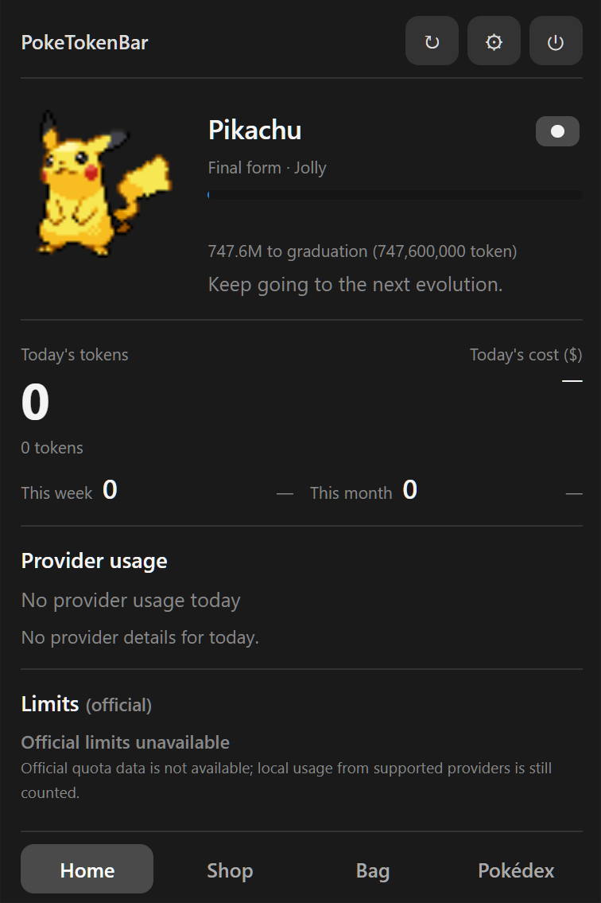
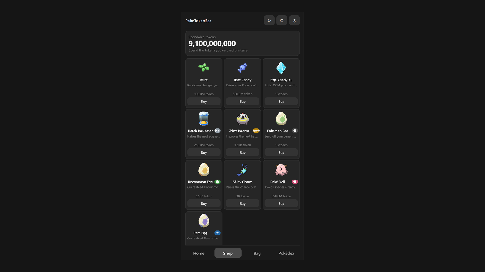
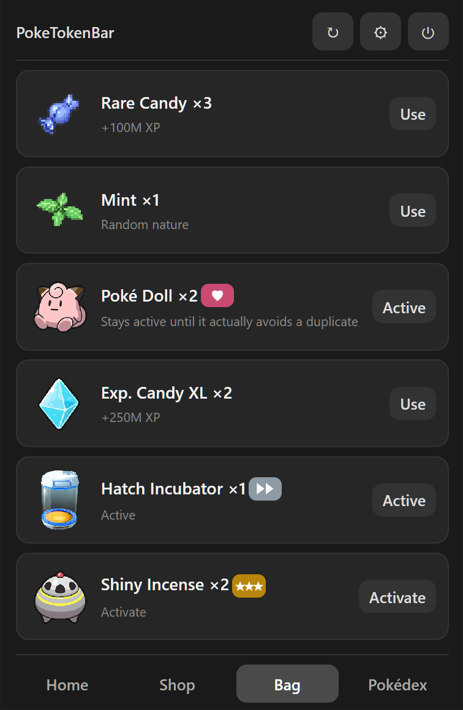
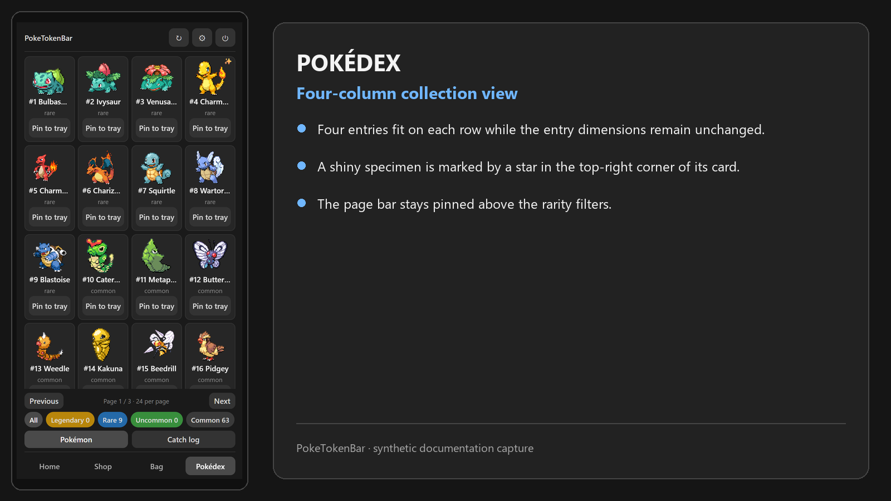
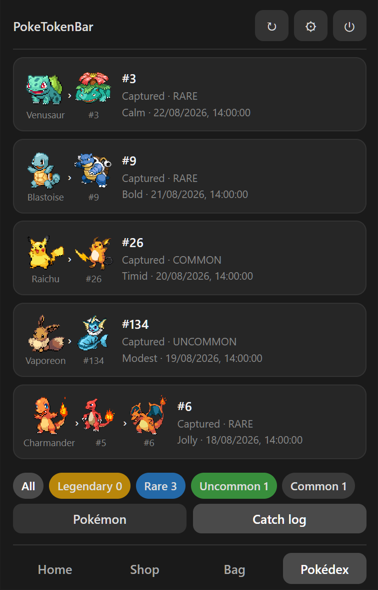
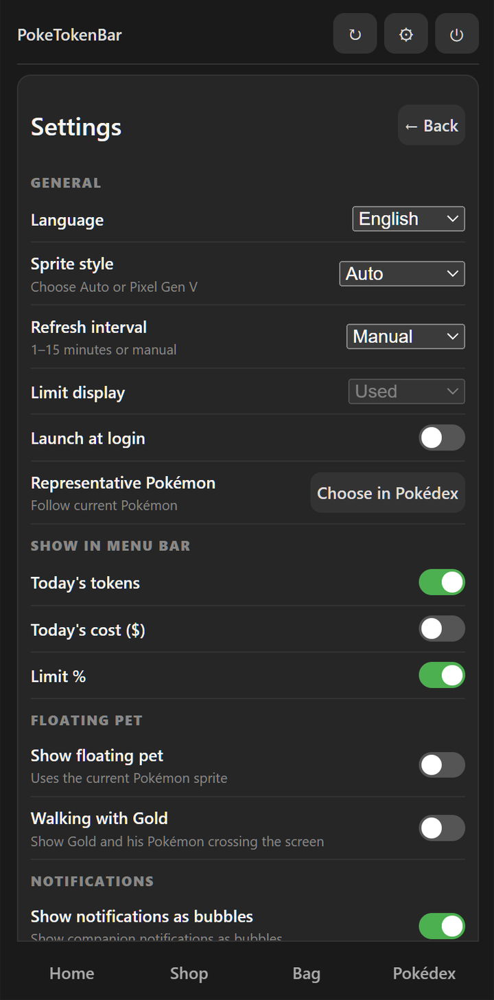
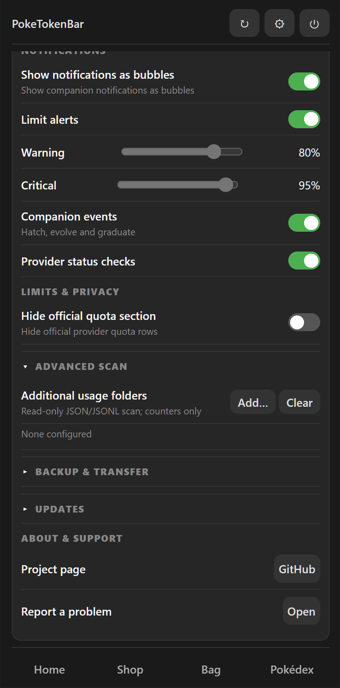

<p align="center">
  
</p>

<h1 align="center">PokeTokenBar</h1>

<p align="center">
  <strong>Turn local AI coding usage into Pokémon progress.</strong><br>
  A quiet tray companion that turns everyday development into a small collection game.
</p>

<p align="center">
  <a href="https://github.com/MarkusSela/PokeTokenBarWindows/actions/workflows/ci.yml"></a>
  <a href="https://github.com/MarkusSela/PokeTokenBarWindows/releases"></a>
  <a href="LICENSE"></a>
  <a href="https://ko-fi.com/marukoshi"></a>
</p>

<p align="center" aria-label="Language selector">
  <a href="README.md">🇬🇧 <strong>English</strong></a>
  &nbsp;|&nbsp;
  <a href="README.zh-CN.md">🇨🇳 简体中文</a>
  &nbsp;|&nbsp;
  <a href="README.it.md">🇮🇹 Italiano</a>
  &nbsp;|&nbsp;
  <a href="README.ja.md">🇯🇵 日本語</a>
  &nbsp;|&nbsp;
  <a href="README.ko.md">🇰🇷 한국어</a>
</p>

> **Current release: v0.2.0**

## About this project

PokeTokenBar is an independent desktop companion inspired by the original [PokeTokenBar project](https://github.com/chattymin/PokeTokenBar). This repository contains the Windows build: local AI coding usage becomes an egg, then a companion, then a growing Pokédex.

The app stays in the notification area and opens a compact Home popover when needed. Provider data remains on the machine, while PokeTokenBar keeps its own progression state separately.

## ✨ What it does

- 🥚 **Turns usage into progress:** local usage feeds the active egg, which can hatch, evolve, and graduate.
- 📊 **Shows the numbers that matter:** see daily, weekly, monthly, and rolling usage when the source provides it.
- 📚 **Builds a collection:** keep graduated companions in the Pokédex and review each individual in the Catch Log.
- 🛍️ **Adds a reward loop:** use Shop and Bag for eggs, Rare Candy, Mints, Exp. Candy XL, Hatch Incubator, Shiny Incense, Shiny Charm, and Poké Doll.
- 🗺️ **Covers the full Pokédex:** 1,025 species across generations I–IX, animated sprites where valid sources exist, canonical English species names, and one rarity per evolution line.
- 🫧 **Stays out of the way:** open Home from the tray or enable an optional floating companion without adding another taskbar button.
- 📁 **Accepts extra local sources:** add JSON or JSONL folders when a tool stores usage outside the built-in locations.
- 🔒 **Keeps the boundary clear:** provider data is read-only; the app does not need a server, SSH, Tailscale, Home Assistant, or a remote usage service.

## 🔁 How progression works

1. The app reads supported usage metadata locally.
2. New usage advances the active egg.
3. At the hatch decision point, the egg selects a Pokémon from the built-in catalogue.
4. More progress unlocks evolution stages and eventually graduates the companion.
5. The Pokédex and Catch Log keep the local collection history.

The progression state belongs to PokeTokenBar. It does not write back to Hermes or to any provider source.

### Poké Doll

The Poké Doll costs **250,000,000 tokens**. Activate it from the Bag while an egg is incubating: it stays armed until it actually prevents a normal duplicate, and only then is it consumed. Normal species already represented in the Pokédex are excluded when an alternative exists; shiny variants remain valid, so a shiny duplicate leaves the Doll armed. If every eligible species is already owned, the hatch waits and the Doll stays armed. From 40% Pokédex completion onward, Home warns when an egg is incubating without the Doll armed.

### Hatch modifiers and shiny odds

- Base egg requirement: **5,000,000 tokens**.
- Hatch Incubator: halves the next egg requirement to **2,500,000 tokens**.
- Base shiny odds: **1/64**.
- Shiny Charm: **1/48**.
- Shiny Incense: **1/32**, or **1/24** together with Shiny Charm.
- Hatch Incubator and Shiny Incense are consumed only after a successful hatch.
- Exp. Candy XL adds **250,000,000 progress** to the active Pokémon without changing usage accounting.

## 📸 Screenshots

The images below are synthetic documentation captures of the native application popover. They contain only the app window: no desktop, browser, explanatory canvas, or account data.

<table class="screenshot-table">
  <thead>
    <tr>
      <th width="40%">Screenshot</th>
      <th align="left">What it shows</th>
    </tr>
  </thead>
  <tbody>
    <tr>
      <td align="center">
        <br>
        <strong>🏠 Home</strong>
      </td>
      <td class="screenshot-explanation">
        <strong>The place to start.</strong><br>
        Home shows the active egg or Pokémon, progress, usage totals, provider details, and official-limit availability. The synthetic capture uses Pikachu as the representative companion and opens from the tray without creating a second taskbar button.
      </td>
    </tr>
    <tr>
      <td align="center">
        <br>
        <strong>🛍️ Shop</strong>
      </td>
      <td class="screenshot-explanation">
        <strong>A place to spend progression tokens.</strong><br>
        Shop uses a three-column card grid. Each card has artwork, a name, an adjacent badge, a short description, a price, and an explicit purchase action. The synthetic view includes the three new hatch/progress items and the three egg tiers.
      </td>
    </tr>
    <tr>
      <td align="center">
        <br>
        <strong>🎒 Bag</strong>
      </td>
      <td class="screenshot-explanation">
        <strong>Use what you have earned.</strong><br>
        Bag distinguishes immediate actions from hatch modifiers. Rare Candy, Mint, and Exp. Candy XL act on the active Pokémon; Poké Doll, Hatch Incubator, and Shiny Incense arm the next hatch. The heart, silver fast-forward, and ochre three-star badges sit beside the item names.
      </td>
    </tr>
    <tr>
      <td align="center">
        <br>
        <strong>📖 Pokédex</strong>
      </td>
      <td class="screenshot-explanation">
        <strong>See the collection at a glance.</strong><br>
        The Pokédex shows four entries per row, one public rarity per evolution line, and a shiny star in the top-right corner of shiny entries. The page bar stays pinned above the rarity filters, with 24 entries per page.
      </td>
    </tr>
    <tr>
      <td align="center">
        <br>
        <strong>🗂️ Catch Log</strong>
      </td>
      <td class="screenshot-explanation">
        <strong>Keep each companion's story.</strong><br>
        Catch Log separates collected histories from the current progression and shows the evolution chain, rarity, nature, shiny state, and synthetic date for each companion.
      </td>
    </tr>
    <tr>
      <td align="center">
        <br>
        <br>
        <strong>⚙️ Settings & progression</strong>
      </td>
      <td class="screenshot-explanation">
        <strong>Control the local experience.</strong>
        <ul>
          <li><strong>General:</strong> language, sprite style, refresh cadence, limit display, launch-at-login, and representative Pokémon.</li>
          <li><strong>Tray:</strong> choose which daily totals and limit details appear in the tray tooltip.</li>
          <li><strong>Companion:</strong> show or hide the floating pet, adjust its size, and configure the optional Gold overlay.</li>
          <li><strong>Updates and notifications:</strong> choose update notices, bubbles, limits and companion events.</li>
          <li><strong>Advanced scan:</strong> add extra JSON or JSONL folders in read-only counter mode. The displayed path is synthetic.</li>
        </ul>
        Settings change PokeTokenBar's own display and progression behavior; they do not modify Hermes or provider files.
      </td>
    </tr>
  </tbody>
</table>

See [`docs/SCREENSHOTS.md`](docs/SCREENSHOTS.md) for the image index and the rules used to keep documentation data anonymous.

## 🔌 Local sources

The app checks each source independently and skips locations that are not installed. Built-in readers currently cover:

- Claude Code
- Gemini CLI
- Antigravity
- Codex
- OpenCode
- Cursor
- Grok CLI
- GitHub Copilot CLI
- Kiro CLI
- Pi Agent
- Hermes Agent local SQLite usage

PokeTokenBar reads only the usage metadata needed for totals and attribution. It does not need prompts or message bodies. Hermes data is opened read-only and remains compatible with a live SQLite WAL database.

Official quota values appear only when a local source provides them. If that data is unavailable, the interface says so instead of inventing a percentage or reset time.

## 🔒 Privacy and local data

PokeTokenBar is designed around local data:

- no telemetry or analytics service;
- no upload of usage data;
- no remote database;
- no SSH, Tailscale, or Home Assistant dependency;
- provider databases and log files are read-only;
- prompts, credentials, API keys, tokens, cookies, and connection strings are not stored in the repository or release assets;
- the companion's progression state stays outside the repository in the normal application-data directory;
- exporting a save is an explicit user action and should be treated as personal data.

The release audit rejects personal absolute paths, credential-looking values, local database files, logs, and companion state. See [`SECURITY.md`](SECURITY.md) and [`RELEASE.md`](RELEASE.md) for details.

## 📦 Install

The current release is `v0.2.0`.

1. Open the [Releases page](https://github.com/MarkusSela/PokeTokenBarWindows/releases).
2. Download `PokeTokenBar-Windows-Setup-<version>.exe`.
3. Verify the SHA-256 value with the attached `SHA256SUMS.txt`.
4. Run the installer. PokeTokenBar starts in the notification area; click its icon to open Home.

The installer is not Authenticode-signed, so Windows SmartScreen may display a warning. Check the release source and checksum before installing.

## 🧰 Build from source

Requirements:

- Windows 10 or 11
- Node.js 22 or newer
- npm

```shell
npm ci
npm test
node --check main.cjs
npm run audit:release
npm run dist
```

The installer is written to `dist/PokeTokenBar-Windows-Setup-<version>.exe`. The unpacked application is written to `dist/win-unpacked/`.

For a clean verification run, close previous PokeTokenBar processes before rebuilding. The normal launch path stays tray-first; diagnostic opening is reserved for the documented `PTB_OPEN=1` test path.

## 🤝 Contributing

Issues and pull requests are welcome. Please:

- describe the smallest reproducible steps;
- use synthetic data whenever possible;
- do not attach provider logs, Hermes databases, prompts, credentials, cookies, or exported saves;
- preserve the tray-first lifecycle and the read-only provider boundary.

Start with [`CONTRIBUTING.md`](CONTRIBUTING.md) for the local test workflow.

## 🔗 Links

- [Project repository](https://github.com/MarkusSela/PokeTokenBarWindows)
- [Releases](https://github.com/MarkusSela/PokeTokenBarWindows/releases)
- [Report an issue](https://github.com/MarkusSela/PokeTokenBarWindows/issues/new)
- [Original PokeTokenBar project](https://github.com/chattymin/PokeTokenBar)

## 💛 Support

If PokeTokenBar is useful to you, you can support its maintenance on [Ko-fi](https://ko-fi.com/marukoshi). Support helps with upkeep, testing, and interface polish. It does not unlock features, and it never sends usage data anywhere.

## 🙏 Acknowledgments

Thanks to the original [PokeTokenBar project](https://github.com/chattymin/PokeTokenBar) for the companion concept and progression loop that inspired this build.

This project also uses:

- [Electron](https://www.electronjs.org/) for the desktop runtime;
- [PokéAPI](https://pokeapi.co/) and the [PokéAPI sprites repository](https://github.com/PokeAPI/sprites) for Pokémon data and imagery;
- the maintainers of the local AI tools whose usage formats make read-only aggregation possible;
- the testers and issue reporters who provide reproducible feedback without sharing private logs or credentials.

## 📄 License

The source code in this repository is released under the [MIT License](LICENSE). The license applies to this project's source code and does not grant rights to third-party trademarks, artwork, or data accessed through the app.

PokeTokenBar is an unofficial, non-commercial fan project. It is not affiliated with, endorsed, sponsored, or approved by Nintendo, Game Freak, Creatures Inc., or The Pokémon Company. “Pokémon” and related names, characters, and imagery belong to their respective owners.

The application is provided “as is”, without warranty of any kind. This notice is not legal advice.
